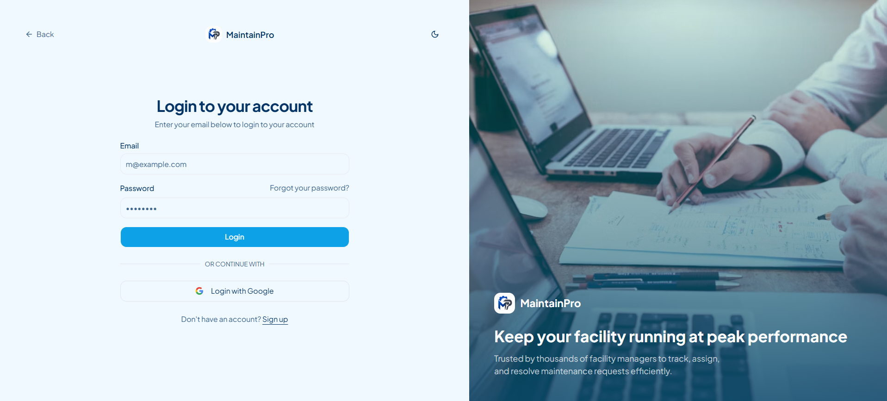
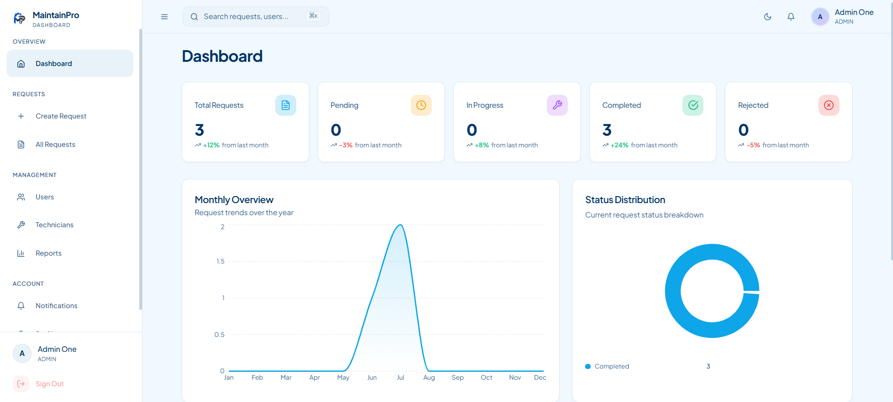

<div align="center">


# MaintainPro
### Maintenance Request Management System

*A complete enterprise-level platform for streamlining maintenance operations*

[](https://dotnet.microsoft.com/)
[](https://react.dev/)
[](https://www.typescriptlang.org/)
[](https://tailwindcss.com/)
[](https://www.microsoft.com/sql-server)
[](LICENSE)

</div>

---

## 📸 Screenshots

<div align="center">

### 🏠 Landing Page


---

### 🔐 Login Page


---

### 📊 Admin Dashboard


---

### 👤 Requester Dashboard


</div>

---

## ✨ Key Features

| Feature | Description |
|---|---|
| 🔐 **JWT Authentication** | Secure login with role-based access control |
| 👥 **Three Role System** | Admin, Technician, Requester – each with tailored dashboards |
| 📋 **Request Lifecycle** | Full PENDING → ASSIGNED → IN_PROGRESS → COMPLETED flow |
| 🔔 **Notifications** | Real-time in-app alerts for assignments, comments, status changes |
| 🖼️ **Image Uploads** | Evidence images on creation, completion images on closure |
| 💬 **Comments** | Per-request discussion thread between all parties |
| 📈 **Analytics Dashboard** | Charts for monthly trends, status distribution, technician performance |
| 📝 **Reports** | Exportable data reports for Admins |
| 📜 **Activity Logs** | Full audit trail of every action in the system |
| 🌙 **Dark / Light Mode** | Fully responsive UI with theme toggle |

---

## 🛠️ Tech Stack

### Frontend
- **React 19** + **TypeScript** + **Vite** – Fast, modern SPA
- **Tailwind CSS** + **Shadcn/UI** – Premium component library
- **TanStack Query** – Data fetching & cache management
- **Zustand** – Lightweight global state management
- **React Hook Form** + **Zod** – Form handling & validation
- **Axios** – HTTP client
- **Recharts** – Data visualization charts
- **Lucide React** + **Sonner** – Icons & toast notifications

### Backend
- **ASP.NET Core Web API (.NET 8)**
- **Entity Framework Core** – ORM & migrations
- **JWT Authentication** – Secure token-based auth
- **BCrypt.Net-Next** – Password hashing
- **Swagger / OpenAPI** – Interactive API documentation

### Database
- **SQL Server** / **MySQL** (switchable via EF Core connection string)

---

## 🚀 Getting Started

### Prerequisites
- **Node.js** 18+
- **.NET 8 SDK**
- **SQL Server** or **MySQL**

### Backend Setup

```bash
# 1. Navigate to the API project
cd "Maintenance Request System API/Maintenance Request System API"

# 2. Configure your connection string in appsettings.json
# (see configuration section below)

# 3. Apply database migrations
dotnet ef database update

# 4. Run the API
dotnet run
```

**`appsettings.json` Configuration:**
```json
{
  "ConnectionStrings": {
    "DefaultConnection": "Server=localhost;Database=MaintainReqSys;Uid=root;Pwd=your_password;"
  },
  "Jwt": {
    "Key": "your-super-secret-jwt-key-min-32-chars",
    "Issuer": "maintainpro",
    "Audience": "maintainpro"
  }
}
```

### Frontend Setup

```bash
# 1. Navigate to frontend
cd frontend

# 2. Install dependencies
npm install

# 3. Start dev server.
npm run dev
```

## 📁 Project Structure

```
Maintenance Request System/
├── 📂 Maintenance Request System API/
│   └── 📂 Maintenance Request System API/
│       ├── 📂 Controllers/         ← API endpoints
│       ├── 📂 Models/              ← Entity models & enums
│       ├── 📂 Data/
│       │   ├── AppDbContext.cs     ← EF Core DB context
│       │   └── DbSeeder.cs         ← Seed data
│       ├── 📂 Migrations/          ← EF Core migrations
│       ├── Program.cs              ← App entry point
│       └── appsettings.json        ← Configuration
│
└── 📂 frontend/
    ├── 📂 src/
    │   ├── 📂 app/
    │   │   ├── 📂 layouts/         ← Shell/layout components
    │   │   ├── 📂 providers/       ← React context providers
    │   │   ├── 📂 router/          ← Route definitions
    │   │   └── 📂 store/           ← Zustand global state
    │   ├── 📂 team-modules/
    │   │   ├── 📂 auth-users/      ← Login, Register, Profile, Users
    │   │   ├── 📂 dashboard/       ← Admin, Technician, Requester dashboards
    │   │   ├── 📂 requests/        ← Request list, create, details
    │   │   ├── 📂 technicians/     ← Technician directory
    │   │   └── 📂 notifications-reports/  ← Alerts & reports
    │   ├── 📂 components/          ← Shared UI components
    │   ├── 📂 services/            ← Axios API service layer
    │   ├── 📂 types/               ← TypeScript interfaces
    │   └── 📂 lib/                 ← Utilities & helpers
    ├── index.html
    ├── vite.config.ts
    └── tailwind.config.js
```

---

## 👥 Meet the Team

<div align="center">

<table>
  <tr>
    <td align="center" width="200">
      <a href="https://github.com/abdullahi4444">
        
        <br/>
        <strong>Abdullahi Abdiweli</strong>
      </a>
      <br/>
      <sub>Software Developer</sub>
      <br/>
      <br/>
      <a href="https://abdullahi4444.github.io/Abdullahi-Abdiweli-Adam-portfolio/">🌐 Portfolio</a>
    </td>
    <td align="center" width="200">
      <a href="https://github.com/mrmaanka">
        
        <br/>
        <strong>mrmaanka</strong>
      </a>
      <br/>
      <sub>Contributor</sub>
      <br/><br/>
      <a href="https://github.com/mrmaanka">🐙 GitHub</a>
    </td>
    <td align="center" width="200">
      <a href="https://github.com/Bakar-Ae">
        
        <br/>
        <strong>Bakar-Ae</strong>
      </a>
      <br/>
      <sub>Contributor</sub>
      <br/><br/>
      <a href="https://tadamun-crm.vercel.app/">🌐 Website</a>
    </td>
  </tr>
  <tr>
    <td align="center" width="200">
      <a href="https://github.com/abdirahmanismail1882-sud">
        
        <br/>
        <strong>Abdirahman Ismail</strong>
      </a>
      <br/>
      <sub>Contributor</sub>
      <br/><br/>
      <a href="https://github.com/abdirahmanismail1882-sud">🐙 GitHub</a>
    </td>
    <td align="center" width="200">
      <a href="https://github.com/ipra12342">
        
        <br/>
        <strong>Ipraahim Saciid</strong>
      </a>
      <br/>
      <sub>Contributor</sub>
      <br/>
      <br/>
      <a href="https://github.com/ipra12342">🐙 GitHub</a>
    </td>
    <td align="center" width="200">
      <!-- placeholder for symmetry -->
    </td>
  </tr>
</table>

</div>

---

## 📜 License

This project is licensed under the **MIT License** — free to use, modify, and distribute.

---

<div align="center">

Made with ❤️ by the MaintainPro Team · Mogadishu, Somalia 🇸🇴

</div>
